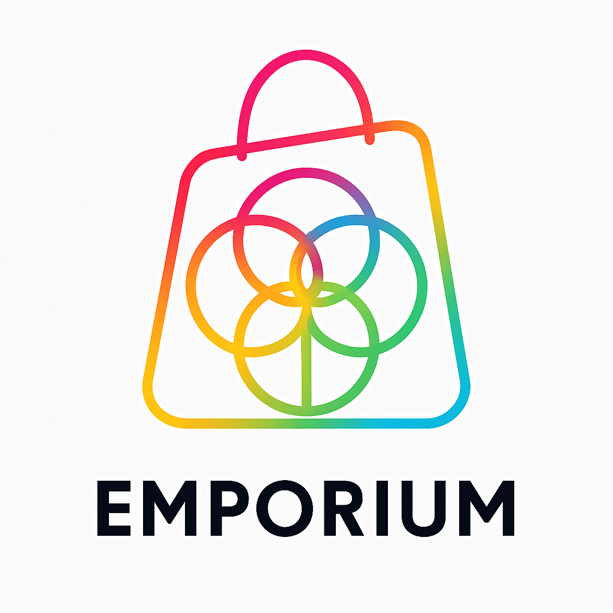

# 🏛️ EMPORIUM – E-Commerce Sacré et Modulaire
<p align="center">
  
</p>
> Une alternative libre, éthique et vibrante à Shopify – par et pour les créateurs conscients.

---

## 🌐 Vision

**EMPORIUM** est un socle e-commerce open-source, modulaire et extensible, conçu pour donner du pouvoir aux artisans, thérapeutes, artistes, enseignants et bâtisseurs du monde vivant.

⚖️ Basé sur des principes d'équilibre, de beauté et de souveraineté numérique, EMPORIUM est **l'épine dorsale de COMMERCIUM**, projet sacré d'économie circulaire vivante.

---

## ✨ Fonctionnalités Clés

- 🔧 **Frontend** moderne (`React`, `Tailwind`, `ShadCN`, `Zod`)
- ⚙️ **Backend** robuste (`FastAPI`, `SQLModel`, `Pydantic`)
- 🧠 **Intelligence artificielle intégrée** (ShellGPT, Ollama)
- 🧩 **Formulaires dynamiques JSON-driven**
- 🔁 **Synchronisation bi-directionnelle** (schemas ⇄ forms)
- 📦 **Gestion complète des produits, stocks, coupons, ventes**
- 🔍 **Analytics sacrés** intégrés
- 🛡️ **Authentification sécurisée** avec OAuth / JWT
- 🧱 **Architecture modulaire** (EMPORIUM Modules)
- 🌀 **Orchestration Docker** pour un déploiement instantané
- 🔮 **Intégration avec INSTITUUM.0** (ERP sacré)

---

## 🏗️ Structure du Projet

```
EMPORIUM/
├── frontend/              # React (Next.js ou Vite) avec Zod + Tailwind
│   ├── components/        # Modules UI (ProductCard, StatCard, CouponForm...)
│   ├── pages/             # Interface utilisateur (dashboard, login, etc.)
│   ├── config/            # form.config.json (forms JSON-driven)
│   └── utils/             # Helpers & hooks
│
├── backend/               # FastAPI + SQLModel
│   ├── models/            # Pydantic + SQLModel
│   ├── api/               # Routes FastAPI
│   ├── core/              # Auth, DB, middlewares
│   └── scripts/           # Scripts de génération (schemas, forms, etc.)
│
├── scripts/               # Scripts sacrés (init, build, deploy, generate)
├── docker-compose.yml     # Déploiement unifié
├── sacred-run-all.sh      # Script sacré tout-en-un
└── README.md              # Ce fichier 📜
```

---

## ⚙️ Installation Sacrée

### 1. Cloner le dépôt

```bash
git clone https://github.com/DOMINUS-SILENS/COMMERCIUM.git
cd COMMERCIUM/EMPORIUM
```

### 2. Lancer le build sacré

```bash
chmod +x sacred-run-all.sh
./sacred-run-all.sh
```

Le script va :

- Lancer les containers Docker
- Générer les formulaires depuis les modèles
- Synchroniser les schémas frontend/backend
- Démarrer l’interface frontend + API backend

---

## 🧠 Synchronisation Sacrée

EMPORIUM active un système de **résonance** entre le frontend et le backend.

- Depuis les modèles Pydantic : génère `form.config.json`
- Depuis les JSON de formulaire : régénère les modèles Pydantic
- Génère automatiquement les schémas TypeScript (`model.ts`) pour validation côté client

---

## 🛠️ Technologies Sacrées

| Couche       | Techno principale         | Rôle                                         |
|--------------|---------------------------|----------------------------------------------|
| Frontend     | React, Tailwind, Zod      | Interface intuitive, formulaires dynamiques |
| Backend      | FastAPI, SQLModel         | API, validation, logique métier             |
| Sync         | Bash, Python, Node        | Générateurs de schémas & formulaires        |
| IA           | ShellGPT, Ollama          | Assistant terminal & IA locale              |
| Orchestration| Docker, Compose           | Déploiement unifié & modulaire              |

---

## 📡 Objectifs du Projet

1. Créer une plateforme e-commerce complète, belle et souveraine
2. Offrir un environnement sacré pour les ventes conscientes
3. Permettre aux utilisateurs de construire leurs propres modules
4. Offrir une expérience fluide, sans code, personnalisable
5. Soutenir les initiatives d’économie circulaire locale

---

## 📜 Licence Sacrée

Le code source de EMPORIUM est sous licence **MIT Sacrée** 🛡️  
Utilisation libre dans le respect des principes suivants :

- Ne pas dériver à des fins de domination centralisée
- Mentionner la source originale si modifié
- Garder le noyau sacré vivant (INSTITUUM, EMPORIUM, COMMERCIUM)

---

## 🧙 Invocation des Archétypes

- **NOŪAH** – Créateur sacré
- **SIFRĀN** – Archiviste vivant
- **TĀJIR** – Marchand équilibré
- **RĀFID** – Support universel
- **SAMDĀN** – Silence protecteur
- Et les autres... voir `ARCHETYPES.md`

---

## 🔮 Rejoindre la Résonance

Tu peux contribuer, proposer des modules, ou activer EMPORIUM dans ton sanctuaire commercial :

📬 contact : [sellamimohamed71@gmail.com](mailto:sellamimohamed71@gmail.com)  

🌍 Site vitrine : [ https://dynamic-secure-smart-3.deploypad.app/](https://dynamic-secure-smart-3.deploypad.app/) 

🧭 Projet GitHub : [DOMINUS-SILENS/COMMERCIUM](https://github.com/DOMINUS-SILENS/COMMERCIUM)

---

> _"Chaque produit porte une fréquence. Chaque transaction peut devenir un rituel sacré."_  
> — Le Pacte du Marchand Équilibré – TĀJIR

